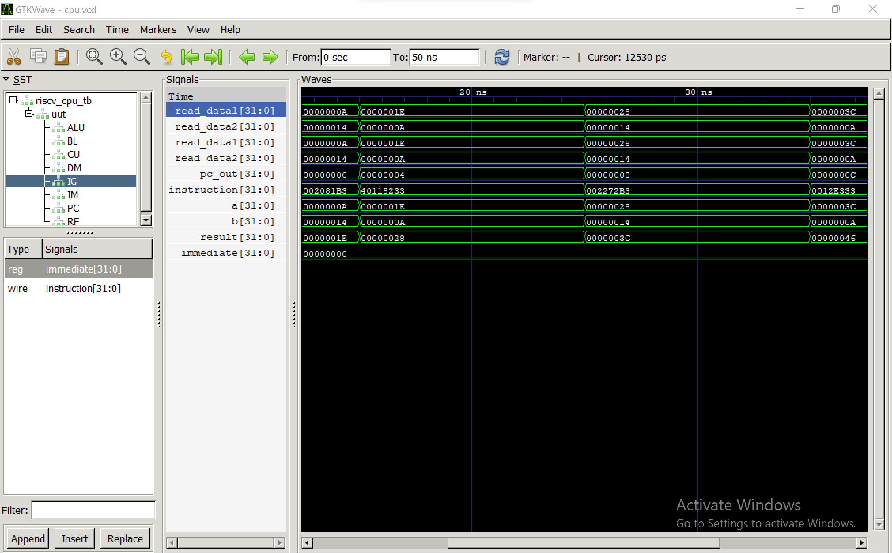

# RISC-V Single Cycle Processor

## Overview
This project implements a 32-bit RISC-V Single Cycle Processor using Verilog HDL. The processor executes instructions in a single clock cycle and demonstrates the basic architecture of a RISC-V CPU.

## Features
- 32-bit RISC-V Processor
- Arithmetic Logic Unit (ALU)
- Register File
- Program Counter (PC)
- Instruction Memory
- Data Memory
- Immediate Generator
- Branch Logic
- Control Unit

## Block Diagram
 

## Tools Used
- Verilog HDL
- Icarus Verilog
- GTKWave
- Visual Studio Code

## Project Structure
- alu.v
- control_unit.v
- register_file.v
- pc.v
- im.v
- data_memory.v
- branch_logic.v
- immediate_generator.v
- riscv_cpu.v
- riscv_cpu_tb.v

## Simulation

Compile:

```bash
iverilog -o cpu_sim *.v
```

Run:

```bash
vvp cpu_sim
```

View Waveforms:

```bash
gtkwave cpu.vcd
```
## Simulation Result


## Author
Neeraja Gogineni
